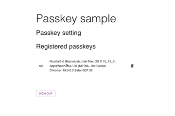

# passkey-impl
This repository is a sample implementation of passkey using React and Golang. A server side uses [go-webauthn/webauthn](https://github.com/go-webauthn/webauthn).



# How to set up
## set up server side
```bash
cd server
go run main.go
```

## set up client side
```bash
cd client
npm run start
```

# How to use
## login with user id
you can login with user id `sample`. password is unnecessary in this application.

## register your passkey
After login, you can register passkey.

## login with passkey
After register passkey, you can login with passkey using auto fill. Auto fill screen will appear when you click user id form.
